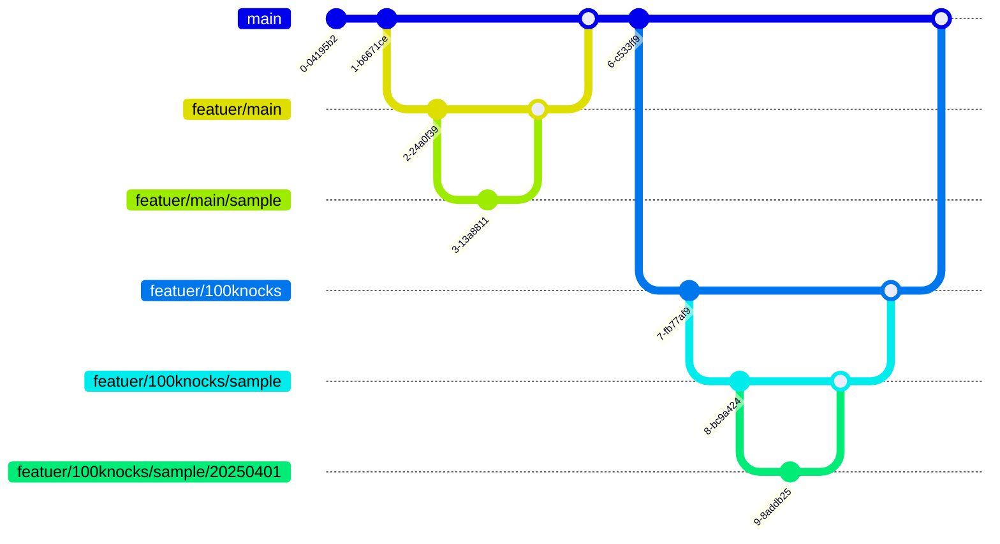

## 運用ルール
### 100本ノックルール 
1. 学習したい100本ノック用のディレクトリを作成する(python用ディレクトリ、TypeScript用ディレクトリ、等)
2. 学習したい100本ノックはディレクトリ事に README を作成してその中に100本ノックをの**問題のみ**を作成する。
3. 問題は基礎から応用まで幅広く学べるものとする。
4. 正誤は毎回確認する。

### ブランチルール戦略

| branch | 用途 | 使用例 |
| - | - | - |
feature/main | 全体ルールや運用に影響のある変更用の branch | featuer/main/docs → 全体ルールの docs を変更
feature/100knocks | 100本ノックのディレクトリ事にブランチを作成し、そのブランチ内で作業日ごとのブランチを作成する | featuer/100knocks/python/20250401 → python 100本ノックの20250401作業branch
